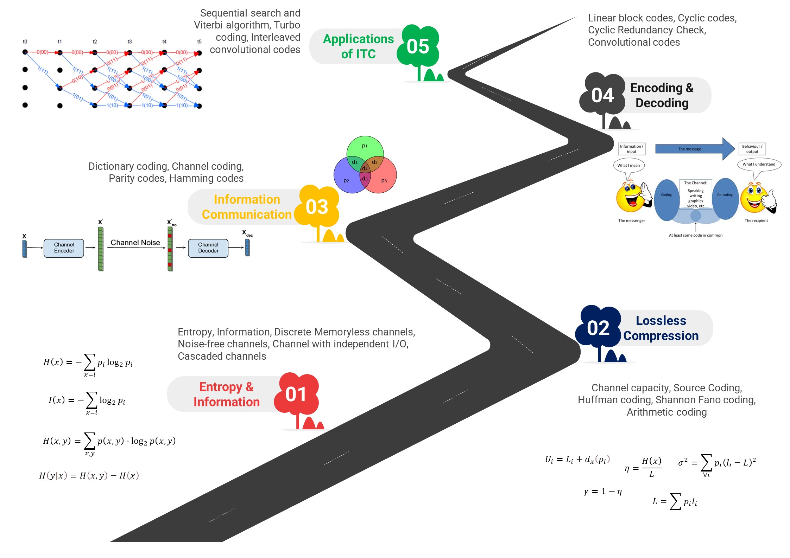

# Information Theory and Coding

- Introduce the principles and applications of information theory.
- How information is measured in terms of probability and entropy.
- The relationships among conditional and joint entropies to calculate the capacity of a communication channel, with and without noise.
- Coding schemes, including error correcting codes.

## Algorithms Implemented:

1. Basics of Information Theory
2. Entropy
3. Discrete Memory Less Channel
4. Huffman Coding
5. Arithmetic Encoding & Decoding
6. Linear Block Code
7. Syndrome Decoding
8. Cyclic Coding (Systematic & Non-Systematic)
9. Convolution Codes
10. Veterbi Decoding
